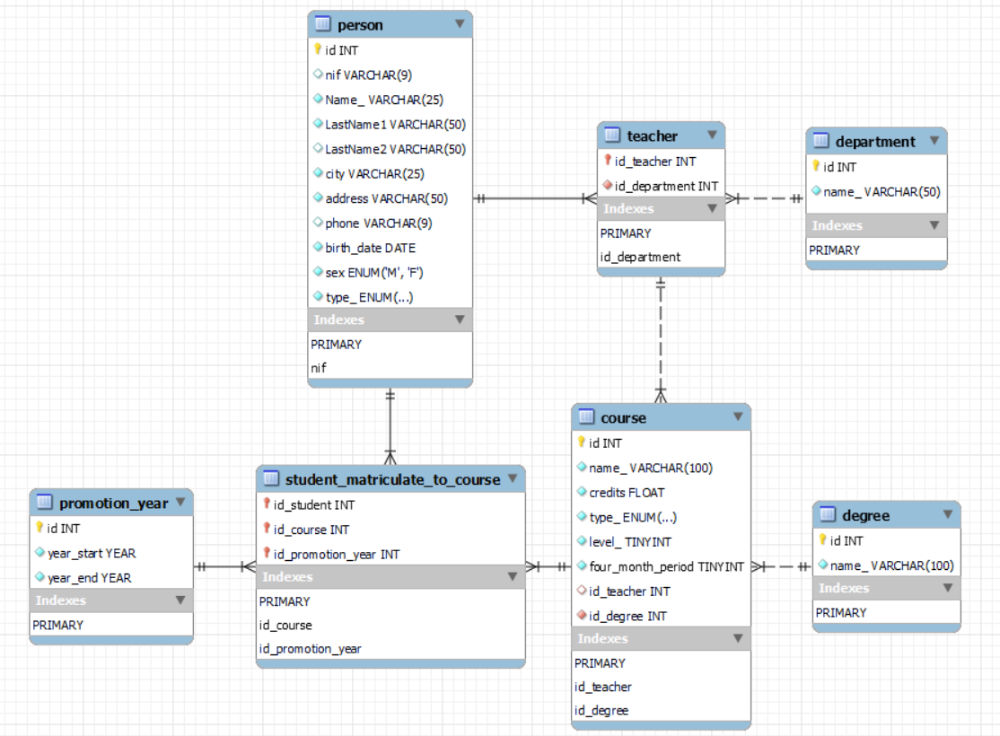
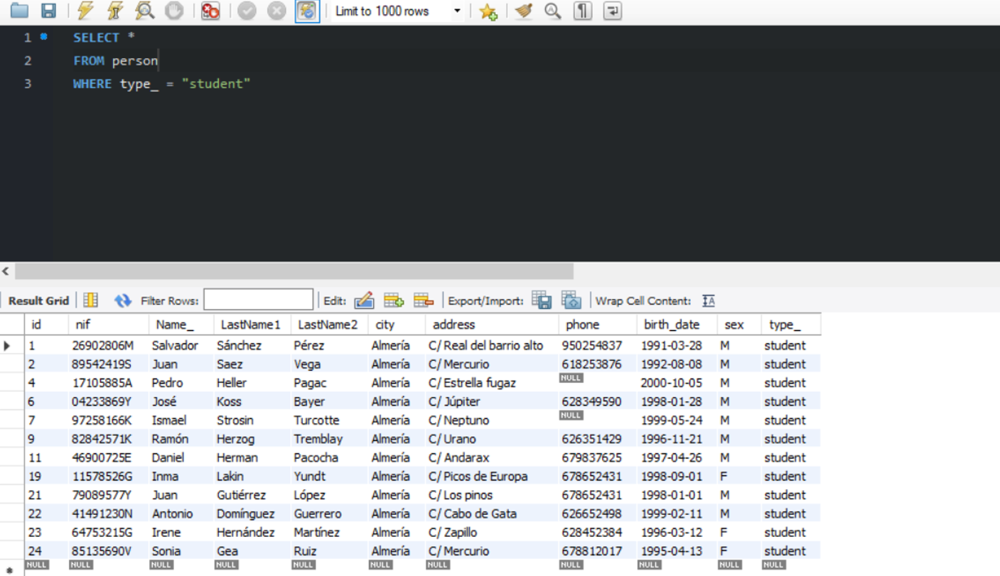
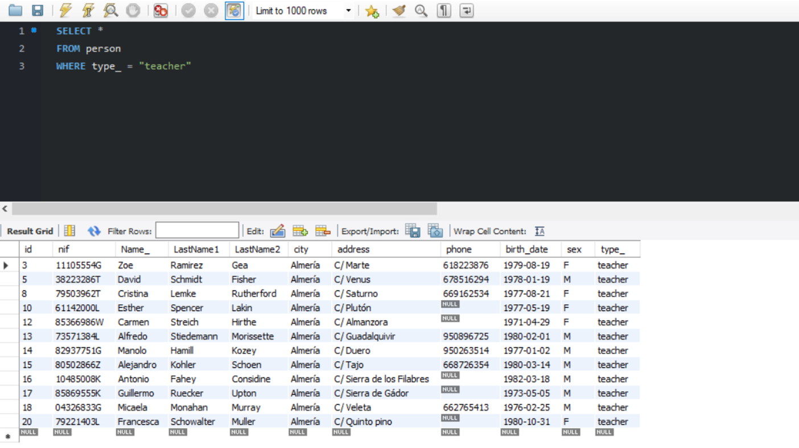
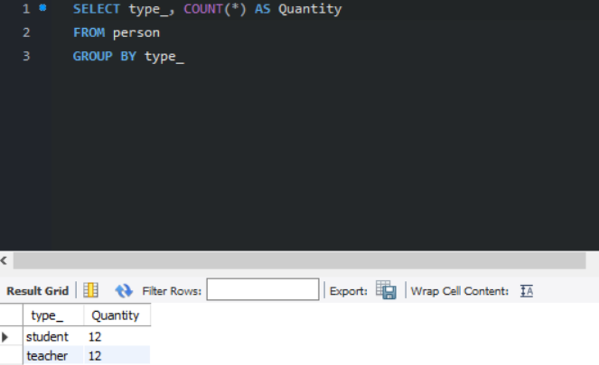
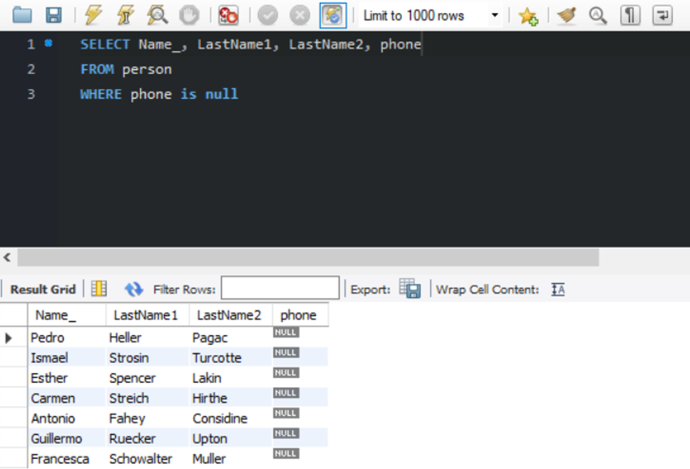
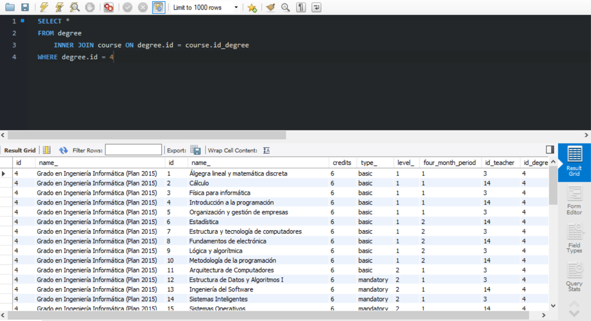
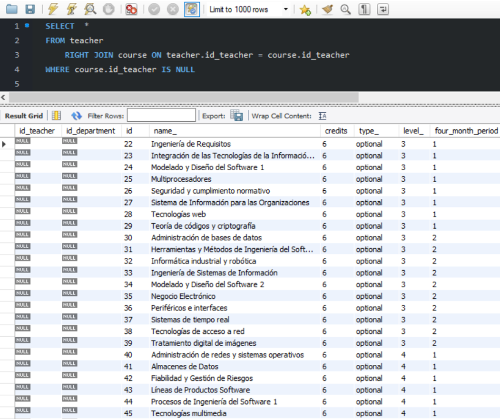

# University management project using MySQL Workbench
This project is available to download the files. Using a database can help us to management in an excellent way all requirements which an organization needs.

It is important to have database in every company, this project allow to organize data of students and teachers, personal data, kind of departments, degrees and promotion years. This also can help us to query for details, have a correct sort, and solve issues.

# Diagram



# MySQL Script
```sql
DROP DATABASE IF EXISTS university;
CREATE DATABASE university CHARACTER SET utf8mb4;
USE university;
 
CREATE TABLE department (
    id INT UNSIGNED AUTO_INCREMENT PRIMARY KEY,
    name_ VARCHAR(50) NOT NULL
);

CREATE TABLE person (
    id INT UNSIGNED AUTO_INCREMENT PRIMARY KEY,
    nif VARCHAR(9) UNIQUE,
    name_ VARCHAR(25) NOT NULL,
    LastName1 VARCHAR(50) NOT NULL,
    LastName2 VARCHAR(50),
    city VARCHAR(25) NOT NULL,
    address VARCHAR(50) NOT NULL,
    phone VARCHAR(9),
    birth_date DATE NOT NULL,
    sex ENUM('H', 'M') NOT NULL,
    type_ ENUM('profesor', 'alumno') NOT NULL
);
 
CREATE TABLE teacher (
    id_teacher INT UNSIGNED PRIMARY KEY,
    id_department INT UNSIGNED NOT NULL,
    FOREIGN KEY (id_teacher) REFERENCES person(id),
    FOREIGN KEY (id_department) REFERENCES department(id)
);
 
 CREATE TABLE degree (
    id INT UNSIGNED AUTO_INCREMENT PRIMARY KEY,
    name_ VARCHAR(100) NOT NULL
);
 
CREATE TABLE course (
    id INT UNSIGNED AUTO_INCREMENT PRIMARY KEY,
    name_ VARCHAR(100) NOT NULL,
    credits FLOAT UNSIGNED NOT NULL,
    type_ ENUM('basic', 'mandatory', 'optional') NOT NULL,
    level_ TINYINT UNSIGNED NOT NULL,
    four_month_period TINYINT UNSIGNED NOT NULL,
    id_teacher INT UNSIGNED,
    id_degree INT UNSIGNED NOT NULL,
    FOREIGN KEY(id_teacher) REFERENCES teacher(id_teacher),
    FOREIGN KEY(id_degree) REFERENCES degree(id)
);
 
CREATE TABLE promotion_year (
    id INT UNSIGNED AUTO_INCREMENT PRIMARY KEY,
    year_start YEAR NOT NULL,
    year_end YEAR NOT NULL
);

CREATE TABLE student_matriculate_to_course (
    id_student INT UNSIGNED NOT NULL,
    id_course INT UNSIGNED NOT NULL,
    id_promotion_year INT UNSIGNED NOT NULL,
    PRIMARY KEY (id_student, id_course, id_promotion_year),
    FOREIGN KEY (id_student) REFERENCES person(id),
    FOREIGN KEY (id_course) REFERENCES course(id),
    FOREIGN KEY (id_promotion_year) REFERENCES promotion_year(id)
);

INSERT INTO department VALUES (1, 'Software');
INSERT INTO department VALUES (2, 'Maths');
INSERT INTO department VALUES (3, 'Economy');
INSERT INTO department VALUES (4, 'Education');
INSERT INTO department VALUES (5, 'Agronomy');
INSERT INTO department VALUES (6, 'Chemistry');
INSERT INTO department VALUES (7, 'Physics');
INSERT INTO department VALUES (8, 'Law');
INSERT INTO department VALUES (9, 'Biology');

INSERT INTO person VALUES (1, '26902806M', 'Salvador', 'Sánchez', 'Pérez', 'Almería', 'C/ Real del barrio alto', '950254837', '1991/03/28', 'M', 'student');
INSERT INTO person VALUES (2, '89542419S', 'Juan', 'Saez', 'Vega', 'Almería', 'C/ Mercurio', '618253876', '1992/08/08', 'M', 'student');
INSERT INTO person VALUES (3, '11105554G', 'Zoe', 'Ramirez', 'Gea', 'Almería', 'C/ Marte', '618223876', '1979/08/19', 'F', 'teacher');
INSERT INTO person VALUES (4, '17105885A', 'Pedro', 'Heller', 'Pagac', 'Almería', 'C/ Estrella fugaz', NULL, '2000/10/05', 'M', 'student');
INSERT INTO person VALUES (5, '38223286T', 'David', 'Schmidt', 'Fisher', 'Almería', 'C/ Venus', '678516294', '1978/01/19', 'M', 'teacher');
INSERT INTO person VALUES (6, '04233869Y', 'José', 'Koss', 'Bayer', 'Almería', 'C/ Júpiter', '628349590', '1998/01/28', 'M', 'student');
INSERT INTO person VALUES (7, '97258166K', 'Ismael', 'Strosin', 'Turcotte', 'Almería', 'C/ Neptuno', NULL, '1999/05/24', 'M', 'student');
INSERT INTO person VALUES (8, '79503962T', 'Cristina', 'Lemke', 'Rutherford', 'Almería', 'C/ Saturno', '669162534', '1977/08/21', 'F', 'teacher');
INSERT INTO person VALUES (9, '82842571K', 'Ramón', 'Herzog', 'Tremblay', 'Almería', 'C/ Urano', '626351429', '1996/11/21', 'M', 'student');
INSERT INTO person VALUES (10, '61142000L', 'Esther', 'Spencer', 'Lakin', 'Almería', 'C/ Plutón', NULL, '1977/05/19', 'F', 'teacher');
INSERT INTO person VALUES (11, '46900725E', 'Daniel', 'Herman', 'Pacocha', 'Almería', 'C/ Andarax', '679837625', '1997/04/26', 'M', 'student');
INSERT INTO person VALUES (12, '85366986W', 'Carmen', 'Streich', 'Hirthe', 'Almería', 'C/ Almanzora', NULL, '1971-04-29', 'F', 'teacher');
INSERT INTO person VALUES (13, '73571384L', 'Alfredo', 'Stiedemann', 'Morissette', 'Almería', 'C/ Guadalquivir', '950896725', '1980/02/01', 'M', 'teacher');
INSERT INTO person VALUES (14, '82937751G', 'Manolo', 'Hamill', 'Kozey', 'Almería', 'C/ Duero', '950263514', '1977/01/02', 'M', 'teacher');
INSERT INTO person VALUES (15, '80502866Z', 'Alejandro', 'Kohler', 'Schoen', 'Almería', 'C/ Tajo', '668726354', '1980/03/14', 'M', 'teacher');
INSERT INTO person VALUES (16, '10485008K', 'Antonio', 'Fahey', 'Considine', 'Almería', 'C/ Sierra de los Filabres', NULL, '1982/03/18', 'M', 'teacher');
INSERT INTO person VALUES (17, '85869555K', 'Guillermo', 'Ruecker', 'Upton', 'Almería', 'C/ Sierra de Gádor', NULL, '1973/05/05', 'M', 'teacher');
INSERT INTO person VALUES (18, '04326833G', 'Micaela', 'Monahan', 'Murray', 'Almería', 'C/ Veleta', '662765413', '1976/02/25', 'M', 'teacher');
INSERT INTO person VALUES (19, '11578526G', 'Inma', 'Lakin', 'Yundt', 'Almería', 'C/ Picos de Europa', '678652431', '1998/09/01', 'F', 'student');
INSERT INTO person VALUES (20, '79221403L', 'Francesca', 'Schowalter', 'Muller', 'Almería', 'C/ Quinto pino', NULL, '1980/10/31', 'M', 'teacher');
INSERT INTO person VALUES (21, '79089577Y', 'Juan', 'Gutiérrez', 'López', 'Almería', 'C/ Los pinos', '678652431', '1998/01/01', 'M', 'student');
INSERT INTO person VALUES (22, '41491230N', 'Antonio', 'Domínguez', 'Guerrero', 'Almería', 'C/ Cabo de Gata', '626652498', '1999/02/11', 'M', 'student');
INSERT INTO person VALUES (23, '64753215G', 'Irene', 'Hernández', 'Martínez', 'Almería', 'C/ Zapillo', '628452384', '1996/03/12', 'F', 'student');
INSERT INTO person VALUES (24, '85135690V', 'Sonia', 'Gea', 'Ruiz', 'Almería', 'C/ Mercurio', '678812017', '1995/04/13', 'F', 'student');
 
 
INSERT INTO teacher VALUES (3, 1);
INSERT INTO teacher VALUES (5, 2);
INSERT INTO teacher VALUES (8, 3);
INSERT INTO teacher VALUES (10, 4);
INSERT INTO teacher VALUES (12, 4);
INSERT INTO teacher VALUES (13, 6);
INSERT INTO teacher VALUES (14, 1);
INSERT INTO teacher VALUES (15, 2);
INSERT INTO teacher VALUES (16, 3);
INSERT INTO teacher VALUES (17, 4);
INSERT INTO teacher VALUES (18, 5);
INSERT INTO teacher VALUES (20, 6);


INSERT INTO degree VALUES (1, 'Grado en Ingeniería Agrícola (Plan 2015)');
INSERT INTO degree VALUES (2, 'Grado en Ingeniería Eléctrica (Plan 2014)');
INSERT INTO degree VALUES (3, 'Grado en Ingeniería Electrónica Industrial (Plan 2010)');
INSERT INTO degree VALUES (4, 'Grado en Ingeniería Informática (Plan 2015)');
INSERT INTO degree VALUES (5, 'Grado en Ingeniería Mecánica (Plan 2010)');
INSERT INTO degree VALUES (6, 'Grado en Ingeniería Química Industrial (Plan 2010)');
INSERT INTO degree VALUES (7, 'Grado en Biotecnología (Plan 2015)');
INSERT INTO degree VALUES (8, 'Grado en Ciencias Ambientales (Plan 2009)');
INSERT INTO degree VALUES (9, 'Grado en Matemáticas (Plan 2010)');
INSERT INTO degree VALUES (10, 'Grado en Química (Plan 2009)');


INSERT INTO student_matriculate_to_course VALUES (1, 1, 1);
INSERT INTO student_matriculate_to_course VALUES (1, 2, 1);
INSERT INTO student_matriculate_to_course VALUES (1, 3, 1);
INSERT INTO student_matriculate_to_course VALUES (2, 1, 1);
INSERT INTO student_matriculate_to_course VALUES (2, 2, 1);
INSERT INTO student_matriculate_to_course VALUES (2, 3, 1);
INSERT INTO student_matriculate_to_course VALUES (4, 1, 1);
INSERT INTO student_matriculate_to_course VALUES (4, 2, 1);
INSERT INTO student_matriculate_to_course VALUES (4, 3, 1);
INSERT INTO student_matriculate_to_course VALUES (24, 1, 5);
INSERT INTO student_matriculate_to_course VALUES (24, 2, 5);
INSERT INTO student_matriculate_to_course VALUES (24, 3, 5);
INSERT INTO student_matriculate_to_course VALUES (24, 4, 5);
INSERT INTO student_matriculate_to_course VALUES (24, 5, 5);
INSERT INTO student_matriculate_to_course VALUES (24, 6, 5);
INSERT INTO student_matriculate_to_course VALUES (24, 7, 5);
INSERT INTO student_matriculate_to_course VALUES (24, 8, 5);
INSERT INTO student_matriculate_to_course VALUES (24, 9, 5);
INSERT INTO student_matriculate_to_course VALUES (24, 10, 5);
INSERT INTO student_matriculate_to_course VALUES (23, 1, 5);
INSERT INTO student_matriculate_to_course VALUES (23, 2, 5);
INSERT INTO student_matriculate_to_course VALUES (23, 3, 5);
INSERT INTO student_matriculate_to_course VALUES (23, 4, 5);
INSERT INTO student_matriculate_to_course VALUES (23, 5, 5);
INSERT INTO student_matriculate_to_course VALUES (23, 6, 5);
INSERT INTO student_matriculate_to_course VALUES (23, 7, 5);
INSERT INTO student_matriculate_to_course VALUES (23, 8, 5);
INSERT INTO student_matriculate_to_course VALUES (23, 9, 5);
INSERT INTO student_matriculate_to_course VALUES (23, 10, 5);
INSERT INTO student_matriculate_to_course VALUES (19, 1, 5);
INSERT INTO student_matriculate_to_course VALUES (19, 2, 5);
INSERT INTO student_matriculate_to_course VALUES (19, 3, 5);
INSERT INTO student_matriculate_to_course VALUES (19, 4, 5);
INSERT INTO student_matriculate_to_course VALUES (19, 5, 5);
INSERT INTO student_matriculate_to_course VALUES (19, 6, 5);
INSERT INTO student_matriculate_to_course VALUES (19, 7, 5);
INSERT INTO student_matriculate_to_course VALUES (19, 8, 5);
INSERT INTO student_matriculate_to_course VALUES (19, 9, 5);
INSERT INTO student_matriculate_to_course VALUES (19, 10, 5);


INSERT INTO promotion_year VALUES (1, 2014, 2015);
INSERT INTO promotion_year VALUES (2, 2015, 2016);
INSERT INTO promotion_year VALUES (3, 2016, 2017);
INSERT INTO promotion_year VALUES (4, 2017, 2018);
INSERT INTO promotion_year VALUES (5, 2018, 2019);


INSERT INTO course VALUES (22, 'Ingeniería de Requisitos', 6, 'optional', 3, 1, NULL, 4);
INSERT INTO course VALUES (23, 'Integración de las Tecnologías de la Información en las Organizaciones', 6, 'optional', 3, 1, NULL, 4);
INSERT INTO course VALUES (24, 'Modelado y Diseño del Software 1', 6, 'optional', 3, 1, NULL, 4);
INSERT INTO course VALUES (25, 'Multiprocesadores', 6, 'optional', 3, 1, NULL, 4);
INSERT INTO course VALUES (26, 'Seguridad y cumplimiento normativo', 6, 'optional', 3, 1, NULL, 4);
INSERT INTO course VALUES (27, 'Sistema de Información para las Organizaciones', 6, 'optional', 3, 1, NULL, 4); 
INSERT INTO course VALUES (28, 'Tecnologías web', 6, 'optional', 3, 1, NULL, 4);
INSERT INTO course VALUES (29, 'Teoría de códigos y criptografía', 6, 'optional', 3, 1, NULL, 4);
INSERT INTO course VALUES (30, 'Administración de bases de datos', 6, 'optional', 3, 2, NULL, 4);
INSERT INTO course VALUES (31, 'Herramientas y Métodos de Ingeniería del Software', 6, 'optional', 3, 2, NULL, 4);
INSERT INTO course VALUES (32, 'Informática industrial y robótica', 6, 'optional', 3, 2, NULL, 4);
INSERT INTO course VALUES (33, 'Ingeniería de Sistemas de Información', 6, 'optional', 3, 2, NULL, 4);
INSERT INTO course VALUES (34, 'Modelado y Diseño del Software 2', 6, 'optional', 3, 2, NULL, 4);
INSERT INTO course VALUES (35, 'Negocio Electrónico', 6, 'optional', 3, 2, NULL, 4);
INSERT INTO course VALUES (36, 'Periféricos e interfaces', 6, 'optional', 3, 2, NULL, 4);
INSERT INTO course VALUES (37, 'Sistemas de tiempo real', 6, 'optional', 3, 2, NULL, 4);
INSERT INTO course VALUES (38, 'Tecnologías de acceso a red', 6, 'optional', 3, 2, NULL, 4);
INSERT INTO course VALUES (39, 'Tratamiento digital de imágenes', 6, 'optional', 3, 2, NULL, 4);
INSERT INTO course VALUES (40, 'Administración de redes y sistemas operativos', 6, 'optional', 4, 1, NULL, 4);
INSERT INTO course VALUES (41, 'Almacenes de Datos', 6, 'optional', 4, 1, NULL, 4);
INSERT INTO course VALUES (42, 'Fiabilidad y Gestión de Riesgos', 6, 'optional', 4, 1, NULL, 4);
INSERT INTO course VALUES (43, 'Líneas de Productos Software', 6, 'optional', 4, 1, NULL, 4);
INSERT INTO course VALUES (44, 'Procesos de Ingeniería del Software 1', 6, 'optional', 4, 1, NULL, 4);
INSERT INTO course VALUES (45, 'Tecnologías multimedia', 6, 'optional', 4, 1, NULL, 4);
INSERT INTO course VALUES (46, 'Análisis y planificación de las TI', 6, 'optional', 4, 2, NULL, 4);
INSERT INTO course VALUES (47, 'Desarrollo Rápido de Aplicaciones', 6, 'optional', 4, 2, NULL, 4);
INSERT INTO course VALUES (48, 'Gestión de la Calidad y de la Innovación Tecnológica', 6, 'optional', 4, 2, NULL, 4);
INSERT INTO course VALUES (49, 'Inteligencia del Negocio', 6, 'optional', 4, 2, NULL, 4);
INSERT INTO course VALUES (50, 'Procesos de Ingeniería del Software 2', 6, 'optional', 4, 2, NULL, 4);
INSERT INTO course VALUES (51, 'Seguridad Informática', 6, 'optional', 4, 2, NULL, 4);
INSERT INTO course VALUES (52, 'Biologia celular', 6, 'basic', 1, 1, NULL, 7);
INSERT INTO course VALUES (53, 'Física', 6, 'basic', 1, 1, NULL, 7);
INSERT INTO course VALUES (54, 'Matemáticas I', 6, 'basic', 1, 1, NULL, 7);
INSERT INTO course VALUES (55, 'Química general', 6, 'basic', 1, 1, NULL, 7);
INSERT INTO course VALUES (56, 'Química orgánica', 6, 'basic', 1, 1, NULL, 7);
INSERT INTO course VALUES (57, 'Biología vegetal y animal', 6, 'basic', 1, 2, NULL, 7);
INSERT INTO course VALUES (58, 'Bioquímica', 6, 'basic', 1, 2, NULL, 7);
INSERT INTO course VALUES (59, 'Genética', 6, 'basic', 1, 2, NULL, 7);
INSERT INTO course VALUES (60, 'Matemáticas II', 6, 'basic', 1, 2, NULL, 7);
INSERT INTO course VALUES (61, 'Microbiología', 6, 'basic', 1, 2, NULL, 7);
INSERT INTO course VALUES (62, 'Botánica agrícola', 6, 'mandatory', 2, 1, NULL, 7);
INSERT INTO course VALUES (63, 'Fisiología vegetal', 6, 'mandatory', 2, 1, NULL, 7);
INSERT INTO course VALUES (64, 'Genética molecular', 6, 'mandatory', 2, 1, NULL, 7);
INSERT INTO course VALUES (65, 'Ingeniería bioquímica', 6, 'mandatory', 2, 1, NULL, 7);
INSERT INTO course VALUES (66, 'Termodinámica y cinética química aplicada', 6, 'mandatory', 2, 1, NULL, 7);
INSERT INTO course VALUES (67, 'Biorreactores', 6, 'mandatory', 2, 2, NULL, 7);
INSERT INTO course VALUES (68, 'Biotecnología microbiana', 6, 'mandatory', 2, 2, NULL, 7);
INSERT INTO course VALUES (69, 'Ingeniería genética', 6, 'mandatory', 2, 2, NULL, 7);
INSERT INTO course VALUES (70, 'Inmunología', 6, 'mandatory', 2, 2, NULL, 7);
INSERT INTO course VALUES (71, 'Virología', 6, 'mandatory', 2, 2, NULL, 7);
INSERT INTO course VALUES (72, 'Bases moleculares del desarrollo vegetal', 4.5, 'mandatory', 3, 1, NULL, 7);
INSERT INTO course VALUES (73, 'Fisiología animal', 4.5, 'mandatory', 3, 1, NULL, 7);
INSERT INTO course VALUES (74, 'Metabolismo y biosíntesis de biomoléculas', 6, 'mandatory', 3, 1, NULL, 7);
INSERT INTO course VALUES (75, 'Operaciones de separación', 6, 'mandatory', 3, 1, NULL, 7);
INSERT INTO course VALUES (76, 'Patología molecular de plantas', 4.5, 'mandatory', 3, 1, NULL, 7);
INSERT INTO course VALUES (77, 'Técnicas instrumentales básicas', 4.5, 'mandatory', 3, 1, NULL, 7);
INSERT INTO course VALUES (78, 'Bioinformática', 4.5, 'mandatory', 3, 2, NULL, 7);
INSERT INTO course VALUES (79, 'Biotecnología de los productos hortofrutículas', 4.5, 'mandatory', 3, 2, NULL, 7);
INSERT INTO course VALUES (80, 'Biotecnología vegetal', 6, 'mandatory', 3, 2, NULL, 7);
INSERT INTO course VALUES (81, 'Genómica y proteómica', 4.5, 'mandatory', 3, 2, NULL, 7);
INSERT INTO course VALUES (82, 'Procesos biotecnológicos', 6, 'mandatory', 3, 2, NULL, 7);
INSERT INTO course VALUES (83, 'Técnicas instrumentales avanzadas', 4.5, 'mandatory', 3, 2, NULL, 7);
```
# Queries

- Information and data of students:


- Information and data of teachers:


- Quantity of students and teachers:


- Search the name and last name of students without their phone numbers on the database:


- List of courses in the "Ingeniería Informática (Plan 2015)" degree:


- List of courses that have not a teacher assigned:



## End